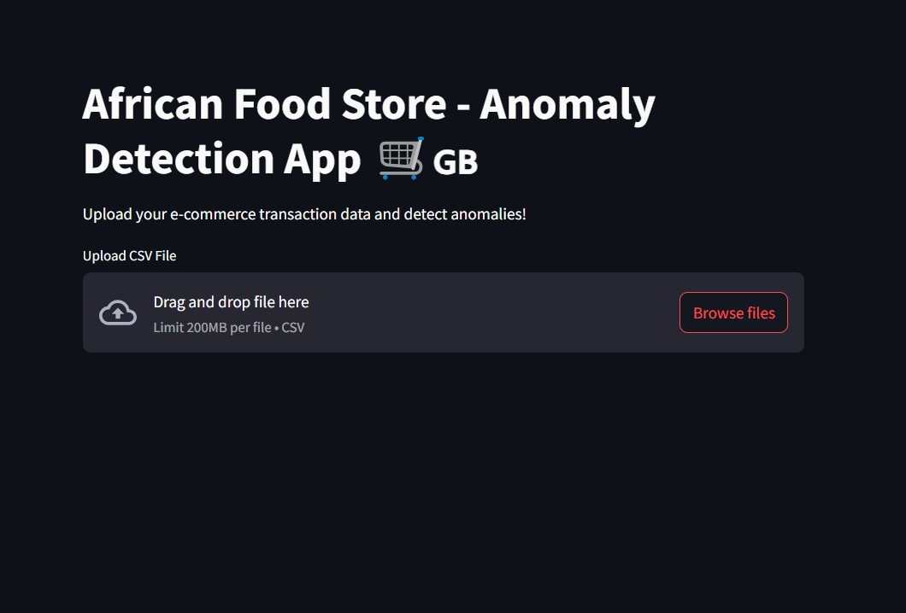
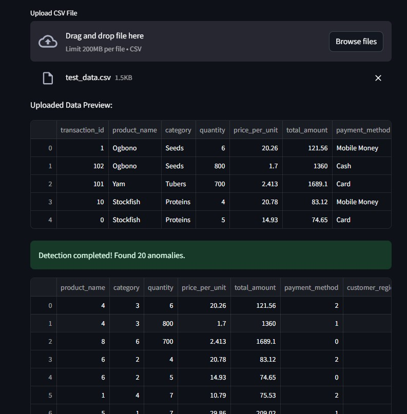

# 🛒 African Foodstore Anomaly Detection App 🇬🇧🌍

This project builds a real-time anomaly detection system for a typical African Food Store's e-commerce data in the UK.

It covers everything from data generation, model training, to a live Streamlit web app where users can upload their transactions and detect anomalies.

---

## 🚀 Project Overview

**Features:**
- Generate synthetic African food e-commerce transactions
- Train and compare three anomaly detection models:
  - Isolation Forest
  - AutoEncoder (Deep Learning)
  - One-Class SVM
- Select and save the best performing model
- Deploy a Streamlit app for real-time anomaly detection
- Allow users to upload CSV files and download detected results

---

## 🌐 Live Demo

You can try the deployed app here:  
👉 [African Foodstore Anomaly Detection App](https://adeyemibolaji-african-foodstore-anomaly-app-kf0qck.streamlit.app/)

---


## 🏗 Project Structure

```bash
african-foodstore-anomaly/
├── app.py                  # Streamlit frontend
├── data/                    # Synthetic dataset and test data
│   ├── ecommerce_data.csv
│   ├── test_data.csv
│   └── generate_data.py
├── models/                  # Model training and saved models
│   ├── train_models.py
│   ├── best_model.pkl or best_model.h5
│   ├── scaler.pkl
├── notebooks/               # EDA and preprocessing notebooks
│   ├── eda_preprocessing.ipynb
│   └── model_training.ipynb
├── requirements.txt         # Project dependencies
├── README.md                 # Project documentation
└── .gitignore
```

---

## 📦 Tech Stack

- **Python 3.12**
- **Streamlit**
- **Scikit-learn**
- **Tensorflow / Keras**
- **Pandas / Numpy**
- **Matplotlib / Seaborn**
- **Joblib**

---

## 🛠 How to Run the Project Locally

1. **Clone the repository:**
   ```bash
   git clone https://github.com/ADEYEMIBolaji/african-foodstore-anomaly.git
   cd african-foodstore-anomaly
   ```

2. **Create a virtual environment (optional but recommended):**
   ```bash
   python -m venv venv
   source venv/bin/activate  # On Mac/Linux
   venv\Scripts\activate     # On Windows
   ```

3. **Install dependencies:**
   ```bash
   pip install -r requirements.txt
   ```

4. **Generate synthetic data (optional):**
   ```bash
   python data/generate_data.py
   ```

5. **Train models:**
   ```bash
   python models/train_models.py
   ```

6. **Run the Streamlit app:**
   ```bash
   streamlit run app.py
   ```

7. **Use the app:**
   - Upload your transaction CSV file.
   - See detected anomalies.
   - Download the cleaned results.

---

## 📸 Screenshots

| Upload CSV | Anomaly Detection Results |
|:-----------|:---------------------------|
|  |  |

*(You can add real screenshots later if you want!)*

---

## ✨ Future Improvements

- Connect to a live database of e-commerce transactions.
- Add email alerts for detected anomalies.
- Improve AutoEncoder architecture for deep anomaly detection.
- Deploy Streamlit app on platforms like **Streamlit Cloud** or **AWS EC2**.

---

## ❤️ Credits

Developed with love for African culture, commerce, and technology 🌍🛒

---

## 📝 License

This project is open source and available under the [MIT License](LICENSE).
